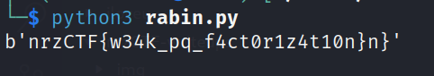

### RabinHood

Task `enc_message.txt`:    

```bash
n=6660423660188053350415327445344395338135348664790719040396624784336604853722943014761799620323706410444163431660904615208170337685693475970366287196615073
c=38080896768148850758642545706513383914345610328716157025260609118399922821551711687146033868308301448170383142388059914302445680656789037595253385481
```

There is a hint in the task name: **Rabin**Hood.    
**Rabin Cryptosystem** is an public-key cryptosystem invented by *Michael Rabin*     

The Rabin cryptosystem relies on the assumption that factoring the modulus n into its prime factors is computationally difficult. The decryption process involves taking the square root modulo n, which can result in multiple possible plaintexts.     

The task involves decrypting a given ciphertext to recover the original plaintext.     

The following python code demonstrates a simple and efficient approach to decrypting ciphertext:     

```python
from Crypto.Util.number import long_to_bytes
from Crypto.Util.number import inverse
from gmpy2 import mpz, iroot

# Given values
n = mpz(hex(6660423660188053350415327445344395338135348664790719040396624784336604853722943014761799620323706410444163431660904615208170337685693475970366287196615073))
c = mpz(hex(38080896768148850758642545706513383914345610328716157025260609118399922821551711687146033868308301448170383142388059914302445680656789037595253385481))

# Decryption
decrypted = iroot(c, 2)[0]

# Convert decrypted value to bytes and print as ASCII
flag = long_to_bytes(int(decrypted))
print(flag)
```

As you can see, `gmpy2.mpz` function is used to handle large integers with arbitrary precision.     

In this implementation, the integer square root is calculated using the `iroot` function, and the first element of the result is considered as the decrypted plaintext.     

Check:    

```bash
python3 rabin.py
```

    

Flag is:

```bash
nrzCTF{w34k_pq_f4ct0r1z4t10n}
```